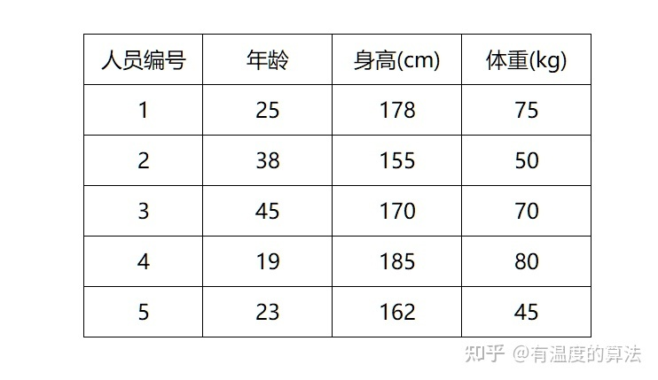
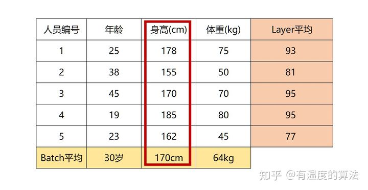
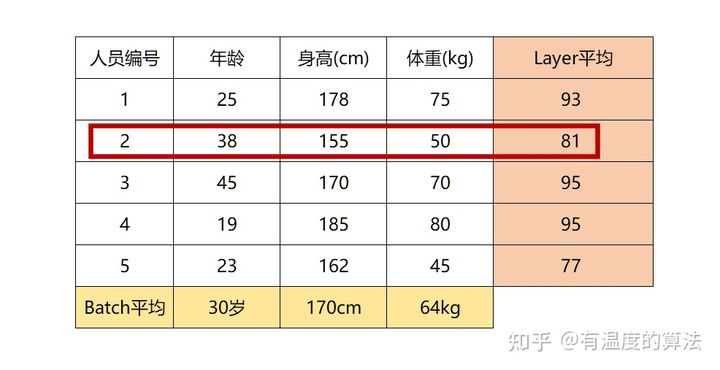
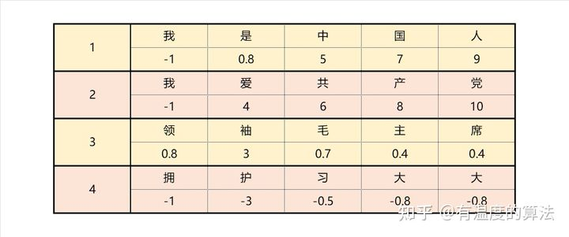
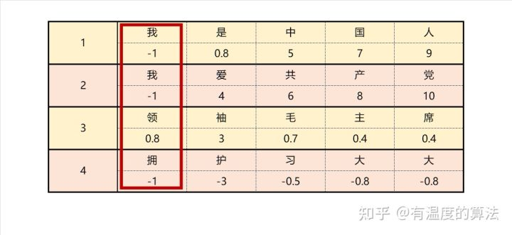
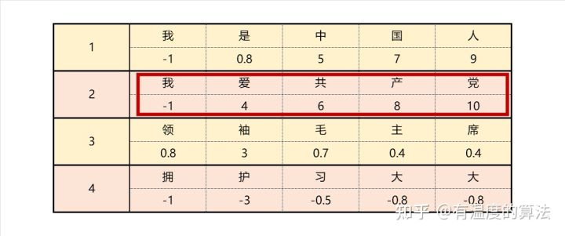
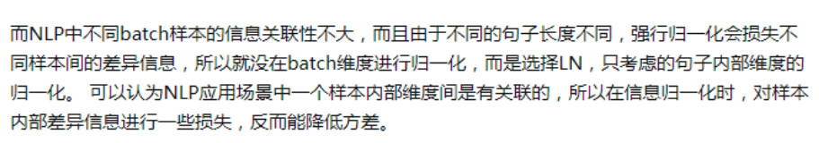

## 与CNN，RNN比较

RNN，LSTM这类时序网络，记忆的长度是有限的，RNN的记忆长度比较短，后面提出LSTM，但是他们还有另外一个问题，是无法并行化，就是我们必须先计算T0时刻的数据，计算完后，我们才能进一步计算T0+1时刻的数据，训练效率就比较低，这也是一件非常痛苦的事情，针对这一问题呢，谷歌就提出了transformer来替代以前的时序网络，在理论上，如果不受设备的限制，他的记忆长度是可以无限长的，其次呢，他是可以做并行化的，这是一个非常大的优点，

self-attention和multihead-attention两个非常重要的模块

## 位置编码图

根据论文公式计算出位置编码，或者可训练的位置编码，作者说没差，但是ViT是可训练的，具体哪个，没定论

ViT比较了使用位置编码和不使用位置编码，使用更好

画postion编码的图

## LN改BN

BN LN

BN 的转换是针对单个神经元可训练的——不同神经元的输入经过再平移和再缩放后分布在不同的区间，而 LN 对于一整层的神经元训练得到同一个转换——所有的输入都在同一个区间范围内。如果不同输入特征不属于相似的类别（比如颜色和大小），那么 LN 的处理可能会降低模型的表达能力。

作者：Juliuszh
链接：https://www.zhihu.com/question/59728870/answer/304645547
来源：知乎
著作权归作者所有。商业转载请联系作者获得授权，非商业转载请注明出处。

作者：AI有温度
链接：https://www.zhihu.com/question/59728870/answer/2218407312
来源：知乎
著作权归作者所有。商业转载请联系作者获得授权，非商业转载请注明出处。

大家好，我是泰哥。在训练模型前，我们通常要对数据进行归一化处理来加速模型收敛。本文为大家介绍`batch normalization`和`layer normalization`的使用场景。

## **1 为什么`ML`中用`BN`比较多？**

现在有一个`batch`内的人员特征数据，分别是年龄、身高和[体重](https://www.zhihu.com/search?q=体重&search_source=Entity&hybrid_search_source=Entity&hybrid_search_extra={"sourceType"%3A"answer"%2C"sourceId"%3A2218407312})，我们需要根据这3个特征进行性别预测，在预测之前首先要进行归一化处理。

## **`ML & batch normalization`**

`BN`是针对每一列特征进行归一化，例如下图中计算的均值： 

`BN`这是一种“[列归一化](https://www.zhihu.com/search?q=列归一化&search_source=Entity&hybrid_search_source=Entity&hybrid_search_extra={"sourceType"%3A"answer"%2C"sourceId"%3A2218407312})”，同一`batch`内的数据的同一纬度做归一化，因此有3个维度就有3个均值。

## **`ML & layer normalization`**

而`LN`则相反，它是针对数据的每一行进行归一化。即只看一条数据，算出这条数据所有特征的均值，例如下图： 

`LN`是一种“[行归一化](https://www.zhihu.com/search?q=行归一化&search_source=Entity&hybrid_search_source=Entity&hybrid_search_extra={"sourceType"%3A"answer"%2C"sourceId"%3A2218407312})”,是对单个样本的所有维度来做归一化。

## **Why `ML&BN`?**

这里大家就可以看出，`LN`计算出一个人的年龄、身高、体重这三个特征的均值并对其归一化，完全没有道理和可解释性，但是`BN`则没有这个影响，因为每列的单位属性都是相同的。

在机器学习任务中，数据往往是每列数据为一特征，处理的数据通常具有解释性，而列与列之间的单位属性并不相同，所以机器学习任务中用`BN`比较多。

## **2 为什么`NLP`中用`LN`比较多？**

上图是4条文本数据组成了一个`batch`，我们假设每个字的`embedding`都为1。

## **`NLP & batch normalization`**

那么`BN`是针对每一列特征进行归一化，就会把4条文本相同位置的字来做归一化处理，例如：我、我、领、拥。 

而这样做的话就破坏了一个字在原句中的原有含义。

## **`NLP & layer normalization`**

而`LN`则是针对每一句话做归一化处理。 

在归一化后使一句话中的`embedding`处于同分布。

## **3 根本原因**

在`ML`中输入的数据一般是[矩阵](https://www.zhihu.com/search?q=矩阵&search_source=Entity&hybrid_search_source=Entity&hybrid_search_extra={"sourceType"%3A"answer"%2C"sourceId"%3A2218407312})，每列数据都具有相同属性，所以使用`BN`较多。

在`NLP`中，因为数据维度一般都是`[batch_size, seq_len, dim_size]`，我们最终希望将一句话中的词[向量](https://www.zhihu.com/search?q=向量&search_source=Entity&hybrid_search_source=Entity&hybrid_search_extra={"sourceType"%3A"answer"%2C"sourceId"%3A2218407312})进行归一化，所以使用`LN`较多。

## **4 总结**

从操作过程上来讲，`BN`针对的是同一个`batch`内的所有数据，而`LN`则是针对单个[样本](https://www.zhihu.com/search?q=样本&search_source=Entity&hybrid_search_source=Entity&hybrid_search_extra={"sourceType"%3A"answer"%2C"sourceId"%3A2218407312})。

从特征维度来说，`BN`对同一`batch`内的数据的同一纬度做归一化，因此有多少维度就有多少个均值和[方差](https://www.zhihu.com/search?q=方差&search_source=Entity&hybrid_search_source=Entity&hybrid_search_extra={"sourceType"%3A"answer"%2C"sourceId"%3A2218407312})；而`LN`则是对单个样本的所有维度来做归一化，因此一个`batch`中就有`batch_size`个均值和方差。

