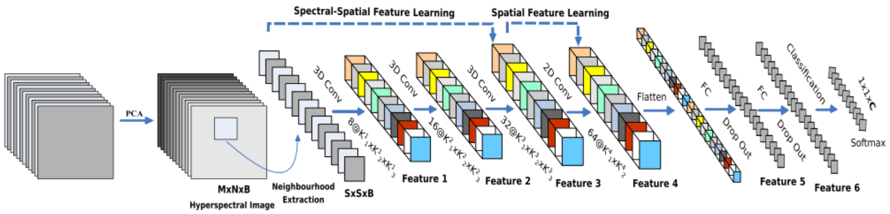

# HybridSN: 3-D–2-D CNN高光谱图像分类

## 文章思路

高光谱图像分类，像素级，使用3D-CNN和2D-CNN

二维CNN可以处理空间信息，无法处理光谱信息。

三维CNN能够同时提取光谱和空间的特征，但代价是增加计算复杂度。

为了充分发挥二维和三维CNN的优势，Swalpa Kumar Roy等人提出了HSI分类模型HybridSN，其模型图如下图所示，它由三个三维卷积、一个二维卷积和三个全连接层组成。

结果是，混合的好，比纯三维卷积，二维卷积分类都好。

## 我的理解

与前面看的RGB图像的3d Conv似乎还不太一样，这里输入的channel不是波段，成了1了，就是1个3d patch，原来的帧，就是几张图像，变成了不同波段的图像了。

## 问题

针对像素点级别的有监督训练分类，每个3d-Patch，标签为中心像素点的标签，但是用到了长为S的周边像素的空间信息，就是这个像素点的分类，与周围空间信息有关，但是像我们的训练集，只是生成的像素点，本身是没有空间信息的，按这样学习到的空间信息就是无效的啊，对实际分类没用啊！

## 参考文献

[HybridSN: Exploring 3-D–2-D CNN Feature Hierarchy for Hyperspectral Image Classification](https://ieeexplore.ieee.org/document/8736016)

[参考博客](https://blog.csdn.net/qq_37555071/article/details/112245853?ops_request_misc=%257B%2522request%255Fid%2522%253A%2522165693761516782390581621%2522%252C%2522scm%2522%253A%252220140713.130102334.pc%255Fblog.%2522%257D&request_id=165693761516782390581621&biz_id=0&utm_medium=distribute.pc_search_result.none-task-blog-2~blog~first_rank_ecpm_v1~rank_v31_ecpm-1-112245853-null-null.185%5Ev2%5Econtrol&utm_term=HybridSN&spm=1018.2226.3001.4450)

