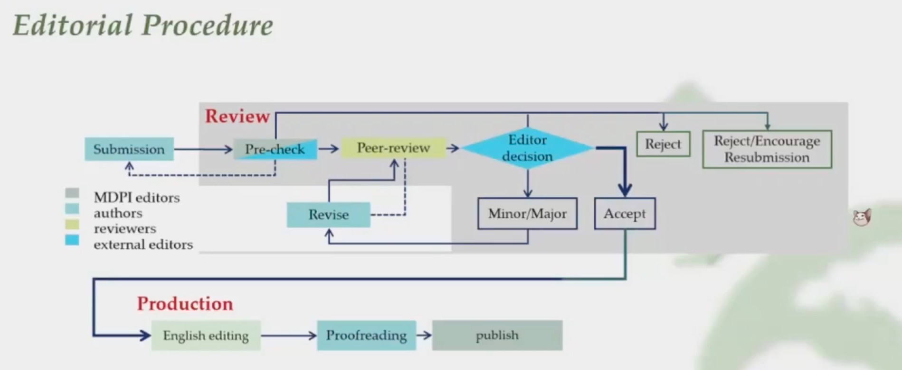
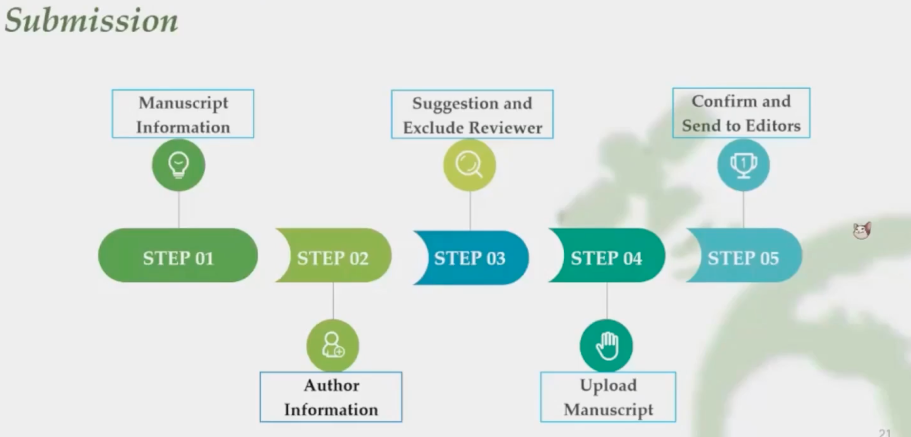
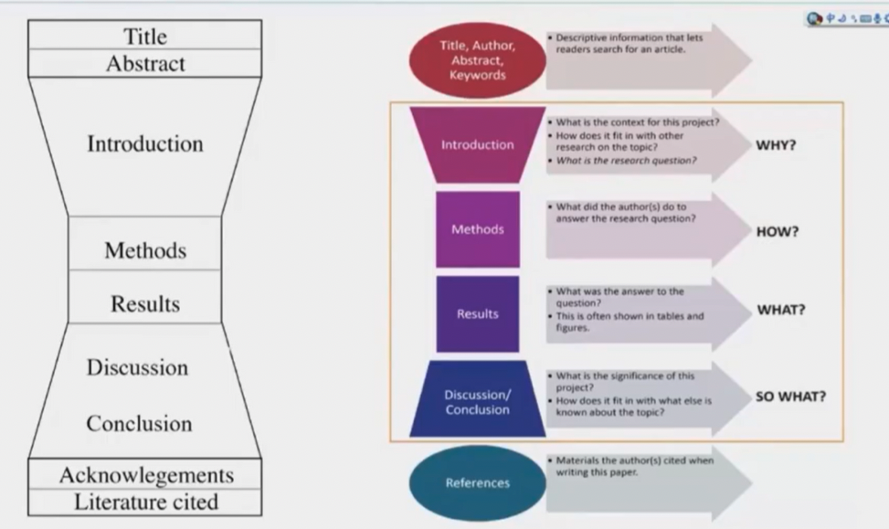
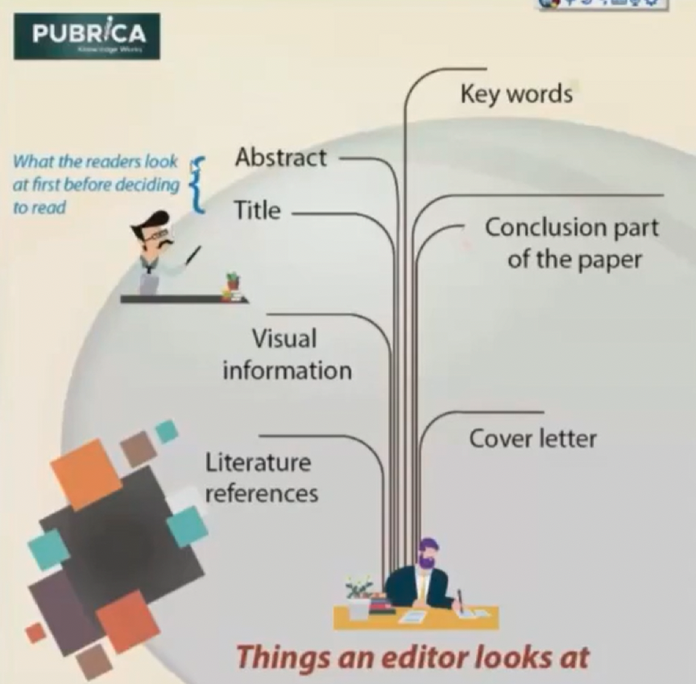
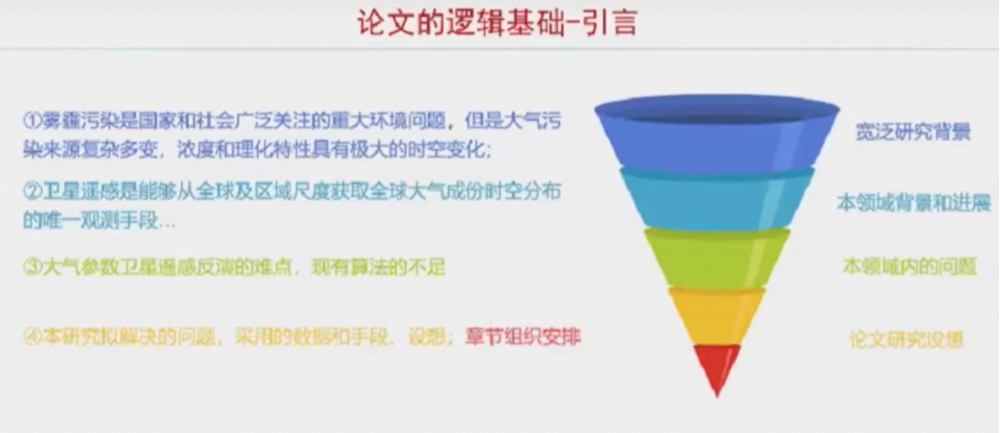

# 科研写作+RemoteSensing

## 如何一个周末写完一篇SCI论文

> https://www.bilibili.com/video/BV1hf4y1r7GF/?spm_id_from=333.788.recommend_more_video.0&vd_source=212d884b9d136f4bb815ae0aa4abb7b0

第一、禁止拖延的想法

第一个准备工作，查看自己的论文笔记， 更新相关文献

第二个准备工作，确定谁是你的听众 ，真正的主要读者是审稿人，他们说期刊的看门人，解决他们的担忧和问题非常重要 

* 哪种文章，research（传统的研究论文），review综述，tutorial（类似于comment评论文章？）

写初稿时候，不要想纠正各种错误，首要工作是，完成完整的初稿，而不是完美的初稿。在完成初稿之前，进行不断的修改完全是浪费时间。

The “Algorithm”

1. **现在开始写，不要拖延**
2. **一个大纲**：列出所有的图和表，需要从大纲开始工作。你脑子里有一篇论文的大概，你有数据，你有表格和图片，将这些表格和图片按顺序排列，按照某种逻辑顺序排列它们，就像你要用它们，和编辑完成一个对话。
3. **不要先写introduction**，这是写论文最难的部分，最简单的事写expriment实验部分，这是你最熟悉的论文的一部分。
4. 下一部分，将集中在怎么写results和discussion
5. 转换为清晰简洁，连贯的英语，确保内容正确
6. 写conclusion/summaries
7. introduciton，两部分，1、为什么要做这项研究，目的是什么？2、本研究的必要背景需要收集，从而使读者有足够的背景来了解你 的研究
8. 参考文献，初稿就弄，不要停下来去收集参考，因为这会中断整个工作流程，如果参考文献处理不当，审稿人和读者会非常恼火

培根说：读书使人渊博，交谈使人机敏，写作使人谨慎。我们在做科研时所做的每一件事，我们都与其他人交谈，但是撰写要发表的论文时，我们要专注于我们的批评，当我们想要确保我们的科学论点是正确的，而且合乎逻辑，所以写作是我们作为一个团队所做的最严格的工作。

最后几点，要经常查看目标期刊的稿件要求，如果不符合要求，编辑会很恶心，可能还没送审就会被拒绝

## Remote Sensing稿件处理

> https://www.bilibili.com/video/BV13R4y1K7pc?spm_id_from=333.337.search-card.all.click&vd_source=212d884b9d136f4bb815ae0aa4abb7b0

### 介绍期刊

**OA期刊**

SCI期刊是科研工作者的发表需求，不论是出于作者自发发表，还是工作需要，又或者是晋升的硬性标准，SCI期刊论文发表成为很多科研工作者的目标，但是很多作者发现，本专业的热门期刊似乎不是那么容易发表，况且传统的出版周期也比较长，很多作者都会选择OA期刊，SCI期刊当中有不少OA期刊，但并不是所有的OA期刊都是SCI期刊，有些作者对于OA期刊存在一定偏见，OA期刊其实就是电子期刊，存在偏见的原因大概就是由于电子期刊有不被认可的可能，下面详细介绍下什么是OA期刊。

那么OA期刊分为完全OA期刊(Full OA journals)和混合OA期刊(Hybrid OA journals)

完全OA期刊是指期刊论文出版之日起就对所有用户提供全文的即时免费访问，期刊全部使用这种开放形式，混合OA期刊是折中了传统期刊和OA期刊运作模式的期刊，总的来说，OA期刊就是一种免费的网络期刊，由于其开放获取的特点，有利于国际上科研成果更有效地传播，不受到科研机构购买数据库的限制，得到了很大的关注。

OA期刊相比传统的订阅期刊其发文量通常会更多一些，审稿周期和发表难度可能会更理想，因此很多科研人员喜欢发表开放获取的期刊，尤其是那些被SCI收录的OA期刊，读者免费获得、无限制使用的运作模式，论文版权由作者保留。

**Remote Sensing**

OA期刊（Open Access开放获取），MDPI公司，2009年创刊，中科院分区二区top。主要发表的是从传感器的设计验证校准，到遥感地球科学，环境生态，工程等方面，各个应用到研究都可以发表，主编，美国USGS的Dr.Prasad S. Thenkabail

12年被收录，有了影响因子；17年分类，有了section；19年影响因子突破4（4.118）；21年4.848

平均处理速度：42天

收到稿件到一轮决定：19.8天

接收到发表：3.4天

方法重复问题不大，创新性，结论不要查重了

### Section

* Atmosphere Remote Sensing
* Remote Sensing in Geology,Geomorphology and Hydrology
* Ocean Remote Sensing
* Forest Remote Sensing
* Remote Sensing in Agriculture and Vegetation
* Remote Sensing Image Processing
* Biogeosciences Remote Sensing
* Urban Remote Sensing
* Environmental Remote Sensing
* Engineering Remote Sensing
* Remote Sensing Letter

Set up in 2020 and 2021

* AI Remote Sensing
* Satellite Missions
* Ecological Remote Sensing
* Earth Observation Data
* Earth Observation for Emergency Management

### 流程

收到稿件后，pre-check，两种情况，一种是由于您的稿件不太符合期刊的要求，没有送审直接去掉，另一种是送到学术编辑手里，评判您的稿件创新性，是否规范，是否值得送审，这个情况下也可能会拒掉您的稿件

当您的稿件比较流畅的进入到了peer review中，邀请审稿人评审，当我们收到了评审意见，一般来说是两份，但可能多于两份

然后把审稿意见送到外编进行评判，由他来决定是送修呢，还是直接接收，或者直接拒掉

接收了，进入到出版阶段，简单的排版工作，语法英修工作，完了文章送给您自己，进行校对，收到校对版本后，我们做一个简短的检查，并最终给您发布上线

### 准备

**基础要求，所有必要的文件，其他确认**

文章类型什么样的，如果是研究型的论文，artical的要求大概是18页以上，结构最好由五部分构成:

* introduction
*  material and methods
* results
* discussion
* conclusion

分开成段，方便审稿人和外编专家对您的稿子有一个梳理

像review类型的文章，基本要求，大于20页

其他类型的文章，都是可以在所投期刊的作者须知那里可以找到一些相关的要求

**必要文件**

有的作者提交的是不可编辑的，前期可能没影响，后期可能接收了，没法调整，再联系作者去提供可编辑版本的一些文件。有一些作者，没按我们的排版，但是他整体的排版是比较干净和正规，像这种情况我们可能不会退回作者去修改，可能直接内部编辑帮您修改。

cover letter 

**其他认证**

一些数据的认证，包括使用的一些图片的版权问题

### 投稿

MDPI自己的投稿系统，叫苏西

输入稿件信息，作者信息，建议审稿人和排除掉的审稿人的推荐，上传稿件，整体信息的确认

推荐使用提供的期刊模板

### 其他

MDPI也提供英修服务

pre prints网站可以发，占坑，跟arXiv一样

## Remote Sensing写作范式

> https://www.bilibili.com/video/BV11r4y1J7Cu?spm_id_from=333.337.search-card.all.click&vd_source=212d884b9d136f4bb815ae0aa4abb7b0
>
> zp记的笔记

### 写文章之前的准备

#### 阅读足够的文献

文献是科学研究的生命，每周精读一篇

文献阅读三个层次：

* 一、了解同行进展
* 二、能对同行成果进行质量评价
* 三、熟悉所在研究方向国内外代表性团队，存在的科学与技术问题，是取得重要成果的基础

#### 具备基本的逻辑

 与可画竹时，胸中有成竹——宋 晁补之

（写完章之前有哪些思路，写哪些点，有什么目的，表达什么内容，呈现什么观点）

#### 选择合适的期刊

学科门类，影响因子

一区TOP？二区TOP？是不是开源的？Index? 领域内TOP期刊？ 

选一个合适的期刊，不同的期刊，定位，风格差别比较大； 

做完一个工作之后，知道更契合哪个期刊的风格？比如，遥感类综合期刊 - 更偏向于遥感，小方向问题

分析-专业期刊,创新点很足（突破性）- SCI

#### 期刊论文的主要组成

WHY? 	---论文的出发点，目的是什么？ 

HOW? 	---发展遥感算法还是做一些新的应用？ 

WHAT? 	---呈现什么样的东西？结论和结果是什么样子的？ 

SO WHAT? ---做了那些结果之后，有没有什么问题？什么局限？通过这个结果，给这个领域带来什么新的信息？ 

不同视角看论文，编辑看一下你的Cover letter 和对应的信息，然后决定你的论文有没有价值去送审。 站在读者和编辑的角度去考虑。

写论文是一个反复迭代的过程。

大致先定个标题，要做什么东西，是写算法类的文章？还是验证类的文章？还是问题分析型文章？

遥感类，先定个标题，然后做关键图，就有清晰的点了，因为要对着图像进行分析，然后写其他内容。

先做算法图或分析图，有一个初步结果，针对这个初步结果，就可以做一些分析了。比如，有两张图是比较有新颖的，就有个idea，基于此，对着这个题目写Induction，最后在写的过程中，你的思路和逻辑不断清晰起来，各个内容会逐步完善。写的过程中，不断梳理自己的逻辑，Induction写完之后就可以讲 你的方法，最后结果，顺着往下描述，讨论和结论。写的过程中不断插入文献。

#### 论文的第一印象-题目

你写的论文要不要看，有没有广泛的受众？看你的题目（不是绝对的）

* 要不要疑问句？更吸引人 
* 自问自答

简明扼要，突出问题，不能说用一个研究领域，或简单的说做了什么内容，应该非常突出你的创新点， 你的新信息应该是要传达的，应该是要放在题目里面的，这样才能有更多的受众。

先定个大致的题目，后面再讨论一个更合适的

#### 论文的精华 - 图

处理遥感，更多的依赖于自己的图像。比如我们一般看论文，先看摘要，然后再看图，看值不值得看。 如果图没有什么新颖，就不会读，相反就去精读，再看用的什么新算法，什么新的分析手段，得出这么好的结果。尤其搞遥感的，个人有题目之后，就去做图，先把大致图做出来。

容易犯的错误，写论文时容易将就，尤其作图，不能马虎，一定要按照你的思路，你的设想，做到尽善尽美，表达你想表达的信息，最好，最清晰的一个效果。不要凑合，会影响表达效果。

**建议：图做好**，边写边改图

作图要精简，多花点时间，非常清晰，有突出性的放在论文里。 结果的展现形式，多花点时间在做图上，这样取得好的展现效果。

#### 论文的逻辑基础-引言

WHY? 为什么要做这个研究？

* 本研究的背景意义？ 
* 已有的进展和不足？ 
* 本论文的研究问题？

（习惯吃完午饭，做到机位上，看行业的新闻）

我自己按照这4点：大背景 - 专业领域 - 所在的方向 - 清晰的逻辑基础

写论文的过程中，看国内外同行进展，更加理解所在的专业有什么意义。

初学的时候，最喜欢看好的研究论文在Induction部分，短短几句话就能把行业的动态介绍的很清晰。好 的论文，三两句也能把行业存在的问题点出来。看足够的文献，也会写出简洁有力的绪论来或者引言 来。Induction写完，感觉自己论文的60% 70%已经写完了，把问题都说清楚了，其他问题就好办多了。¥

#### 数据方法和结果

数据方法和结果更像论文的一个技术说明，当逻辑清楚之后，介绍数据和方法；一个领域的方法去介 绍，应该是耳熟能详的，逻辑可能没有那么完善，做一个初学者；介绍一个东西，你要用哪些数据，数据来源，精度包括方法都有现成的可以参考；很重要，但是没有难点。

Induction写好了，其他的就很流畅。

#### 论文观点的强化和展望 - 讨论

conclusion和abstract不应该一样 ；结论是重述一遍？还是加强一下？conclusion和abstract是否是一回事？

* 摘要是免费的，结论不是，除非你的论文发表在开源期刊 
* 摘要决定你的当前论文值不值得下载，结论决定你的下一篇论文值不值的读 
* 摘要包括研究的目的，论文的大纲，和结果的快速总结 
* （摘要：第一段意义 -第二段 动机 - 然后总结） （结论更多的除了总结你的结果，更多论文的意义，在这个基础上，稍微做点展望）

#### 论文的理论依据 - 参考文献

一个好的习惯，我自己不管写哪个论文，要把他的第一篇找到，然后说一说这个领域，到哪刚开始，通过哪个阶段有哪些转化，然后才到今天这么一个现状。我们大部分人只引用这两年的文章，尽量找一下第一篇文章；

#### 期刊论文写作的一些建议

记住，论文的根本目的是传递新的信息，初学者可能添加琐碎的信息后，逻辑清晰后，一定要回到自己的点上，你的发现，你的观点，尽量回到传递新的信息

* 要有个逻辑框架，表达哪些关键点，你的论文的所有图呀，叙述都要支撑一个或几个关键点 
* 清晰直述论文的新意和优点，再去优化你的图片 
* 摘要：避免特别描述式的描写，要有总结 
* 不要遗漏小的细节 
* 专有名词要有解释，不只是给小同行看，还有大众

#### 期刊论文写作的一些感想

* 写的论文要有文献，还会精读一些文献 
* 论文的根本目的是给别人看的，共情能力
* 同行怎么看你，先是看你的论文，然后才能认识你，写出质量，一旦发表，伴随你一生