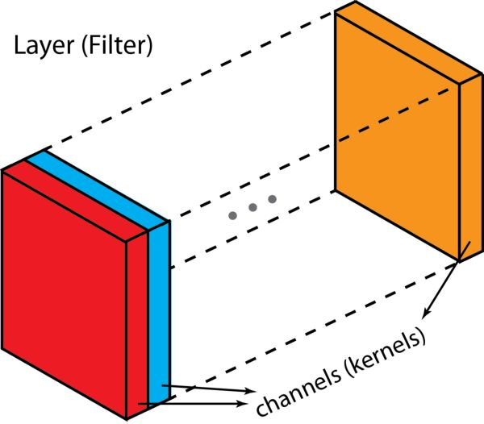
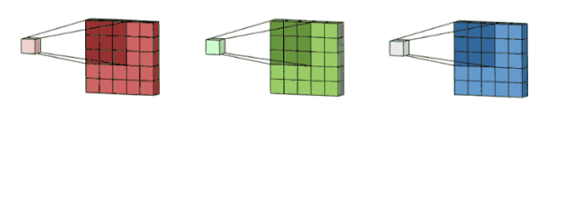
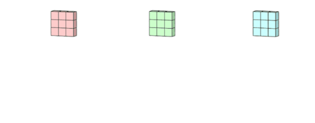
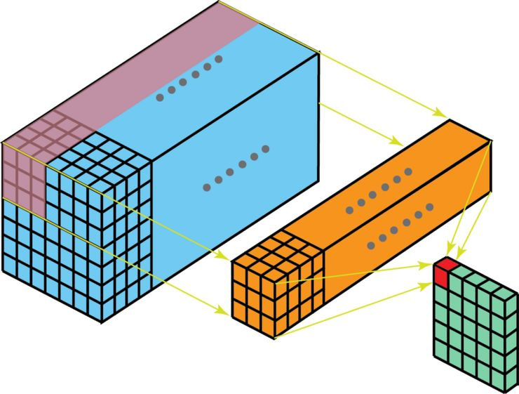
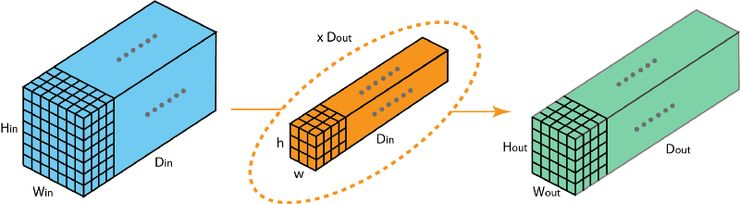
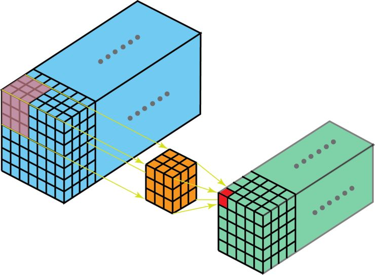

# 二维卷积和三维卷积

## 一些概念

在介绍这个过程之前，我们先搞清楚几个名词：层（layer）、通道（channel）、特征映射（feature map）、过滤器（filter）以及卷积核（kernel）。从层级角度来说，「层」和「过滤器」的概念属于一个层级，而「通道」和「卷积核」都在下一个层级。「通道」和「特征映射」是指同一个东西。一层可以有多个通道（或特征映射）；如果输入的是 RGB 图像，那这个输入层有 3 个通道。「通道」一般用来形容「层」的架构。类似地，「卷积核」则用来形容「过滤器」的架构。

过滤器和卷积核之间的区别非常微妙，有时候，二者可以交替使用，这无疑就制造了些困惑。但根本上来讲，二者还是有些细微区别的：「卷积核」指的是指权重组成的 2D 数组 ；「过滤器」则是由多个卷积核堆叠在一起的 3D 架构概念。对于一个 2D 过滤器来说，过滤器就相当于卷积核，但是对于一个 3D 过滤器以及深度学习中的大多数卷积而言，一个过滤器由一组卷积核组成。每个卷积核都是独一无二的，强调了输入通道的不同方面。

带着对这些概念的了解，下面让我们一起来看看多通道卷积。生成一个输出通道，就需要将每一个卷积核应用到前一层的输出通道上，这是一个卷积核级别的操作过程。我们对所有的卷积核都重复这个过程以生成多通道，之后，这些通道组合在一起共同形成一个单输出通道。下图可以让大家更清晰地看到这个过程。

这里假设输入层是一个 5 x 5 x 3 矩阵，它有 3 个通道。过滤器则是一个 3 x 3 x 3 矩阵。首先，过滤器中的每个卷积核都应用到输入层的 3 个通道，执行 3 次卷积后得到了尺寸为 3 x 3 的 3 个通道。

## Conv2d

面向多通道的 2D 卷积的第一步：过滤器每个卷积核分别应用到输入层的 3 个通道上。之后，这 3 个通道都合并到一起（元素级别的加法）组成了一个大小为 3 x 3 x 1 的单通道。这个通道是输入层（5 x 5 x 3 矩阵）使用了过滤器（3 x 3 x 3 矩阵）后得到的结果。

同样地，我们可以将这个过程视作将一个 3D 过滤器矩阵滑动通过输入层。注意，这个输入层和过滤器的深度都是相同的（即通道数=卷积核数）。这个 3D 过滤器仅沿着 2 个方向（图像的高&宽）移动（这也是为什么 3D 过滤器即使通常用于处理 3D 体积数据，但这样的操作还是被称为 2D 卷积）。在每一个滑过的位置，我们都执行元素级别的乘法和加法，最终得出一个数值。下面这个例子中，过滤器横向滑过 5 个位置、纵向滑过 5 个位置。全部完成后，我们得到了一个单输出通道。

看待 2D 卷积的另一个角度：将这个过程视作将一个 3D 过滤器矩阵滑动通过输入层。注意，这个输入层和过滤器的深度都是相同的（即通道数=卷积核数）。这个 3D 过滤器仅沿着 2 个方向（图像的高&宽）移动（这也是为什么 3D 过滤器即使通常用于处理 3D 体积数据，但这样的操作还是被称为 2D 卷积）。输出是一个 1 层的矩阵。

现在我们可以看到如何在不同深度的层之间实现过渡。假设输入层有 Din 个通道，而想让输出层的通道数量变成 Dout ，我们需要做的仅仅是将 Dout 个过滤器应用到输入层中。每一个过滤器都有 Din 个卷积核，都提供一个输出通道。在应用 Dout 个过滤器后，Dout 个通道可以共同组成一个输出层。

标准 2D 卷积。通过使用 Dout 个过滤器，将深度为 Din 的层映射为另一个深度为 Dout 的层。

## Conv3d

在上部分的最后一张图中，我们看到了将卷积在 3D 体积上的执行情况。但是一般而言，我们依旧将这一操作视为深度学习中的 2D 卷积——3D 体积数据上的 2D 卷积：其过滤器和输入层的深度是一样的；3D 过滤器仅沿着 2 个方向（图像的高&宽）移动。这样操作得出的结果就是一个 2D 图像（仅有 1 个通道）。

有 2D 卷积，自然就有 3D 卷积。3D 卷积是 2D 卷积的一般化。在 3D 卷积中，过滤器的深度要比输入层的深度更小（卷积核大小<通道大小），结果是，3D 过滤器可以沿着所有 3 个方向移动（高、宽以及图像的通道）。每个位置经过元素级别的乘法和算法都得出一个数值。由于过滤器滑动通过 3D 空间，输出的数值同样也以 3D 空间的形式呈现，最终输出一个 3D 数据。

在 3D 卷积中，过滤器的深度要比输入层的深度更小（卷积核大小<通道大小），结果是，3D 过滤器可以沿着所有 3 个方向移动（高、宽以及图像的通道）。每个位置经过元素级别的乘法和算法都得出一个数值。由于过滤器滑动通过 3D 空间，输出的数值同样也以 3D 空间的形式呈现，最终输出一个 3D 数据。

和对 2D 区域中目标的空间关系进行解码的 2D 卷积相似，3D 卷积也可以描述 3D 空间中目标的空间关系。对于一些应用来说，这种 3D 关系很重要，例如在 CT 和 MRI 等生物医学图像的 3D 分割/重建中，这些图像的目标如血管都是蜿蜒分布在 3D 空间中的。