# On the Principles of Parsimony and Self-Consistency for the Emergence of Intelligence

​		论智力产生的简约原则和自洽原则

## 摘要

​		搞了十年深度网络和人工智能，我们提出了一个理论框架，该框架阐明了一般智力的更广阔的智能中的深层网络（a theoretical framework that sheds light on understanding deep networks within a bigger picture of Intelligence in general）。提出了两个基本的原则，简约和自洽，认为这是（人造或自然）智能出现的基础。虽然这两个原则具有丰富的古典根源，我们认为可以以完全可衡量和可计算的方式重新陈述它们。更具体地说，这两个原则导致有效，高效的计算框架，压缩闭环转录，这统一并解释了现代深度网络和许多人工智能实践的演变。虽然我们主要以视觉数据的建模为例，但我们认为这两个原则将统一对‘’自主智能系统的广泛家庭‘’的理解，并为理解大脑提供了一个框架

​		**关键词：**智能；简约（Parsimony）；自洽（Self-Consistency）；速率减小（Rate Reduction）；深度网络；闭环转录

## 1、背景和动机

​		为了使自主智能代理在复杂的环境中生存和运作，它必须有效，高效地学习反映其过去经验和当前环境的模型。这样的模型对于收集信息，做出决策和采取行动至关重要。这些模型通常称为**世界模型（world models**），应从预测与新观察和结果一致的方式中不断改善。他们应该从过去的经验（例如，识别熟悉的对象）和解释即时感觉输入（例如检测和跟踪移动对象）的机制中融合知识。

​		神经科学的研究表明，**大脑的世界模型在解剖学上是高度结构化的**，说的是在结构上（例如，模块化的大脑区域和柱状组织）和功能上（例如，稀疏编码（Olshausen和Field，1996）和子空间编码（Chang和Tsao，2017; Bao等，2017; Bao等，2017; Bao等人。，2020））。人们认为，这种结构化模型是大脑在感知，预测和做出明智决策方面效率和有效性的关键（Barlow，1961； Josselyn和Tonegawa，2020年）。

​		相比之下，在过去的十年中，AI的进展大量依赖于训练同质化的**黑盒模型**，比如DNN（LeCun，2015），使用**蛮力工程方法**，尽管功能模块化可能会来自训练，但学习到的特征表示在很大程度上隐藏或潜在且难以解释。如我们现在所知，端到端黑盒模型的这种昂贵的蛮力训练不仅会导致不断增长的模型大小和高的数据/计算成本，还伴随着许多实践中的问题：

* 由于神经崩溃而致的最终学习表现不足
* 由于模式崩溃而缺乏训练的稳定性
* 缺乏适应性和对灾难性遗忘的敏感性
* 缺乏对变形的鲁棒性或对抗攻击

### 一个 原则的 ，统一的 方法？

​		我们假设，这些问题在当前的深度网络和人工智能实践中出现的基本原因之一是**对智能系统的功能和组织原理缺乏系统和综合的理解**。

​		例如，在实践中，**训练判别模型用来分类，生成模型用来采样或重播，已在很大程度上分开**。这样的模型通常是开环系统，需要通过监督或自监督进行端到端训练。在控制理论中的原则是，这种开环系统不能自动纠正预测中的错误，并且不能适应环境的变化。这导致将“闭环反馈”引入受控系统，以便系统可以学会纠正其错误（Wiener，1948; Mayr，1970）。正如我们将在本文中所说的那样，可将类似的经验应用于此：**一旦将判别模型和生成模型组合在一起以形成完整的闭环系统，学习就可以变得自治（没有外部监督），并且更高效，稳定和自适应。**

​		要了解智能系统中可能需要的任何功能组件，例如判别性或生成部分，我们需要从更原则和统一的角度理解智能。本文介绍了两个基本原则：简约和自洽，我们认为这会控制任何人为或自然的智能系统的功能和设计。这俩原则分别回答两个基础的关于学习的问题：

​		1、**学什么**：从数据中学习的目标是什么？如何衡量它？

​		2、**如何学习**：我们如何通过高效有效的计算实现这一目标？

​		第一个问题的答案自然属于**信息/编码理论**的领域（Shannon，1948年），该领域研究如何准确量化和测量数据的信息，然后寻求信息的最紧凑表示。一旦学习的目的是清晰并设定的，第二个问题的答案自然就落入了控制/博弈理论的领域（Wiener，1948年），该领域提供了一个普遍有效的计算框架，即闭环反馈系统，用于实现任何可测量的目标**一致（consistently）**（图1）。

​		本文提出的两个原则中的每个原则背后的基本思想都可以在经典作品中找到根源。自从其最早成立为“感知机”（Rosenblatt，1958年）以来，人工（深）神经网络被认为有效地存储和组织感官信息。反向传播（Kelley，1960; Rumelhart等，1986）后来被提议作为学习此类模型的一种机制。此外，即使在神经网络成立之前，诺伯特·维纳（Norbert Wiener）也开始考虑在系统级别学习的计算机制。在他著名的《控制论》（Wiener，1948年）中，他研究了在学习机器中使用简约和反馈/博弈的信息压缩角色，以保持一致性。

​		但是我们在这里是为了在数据科学和机器学习的新背景下再结合和重述这两个原则，因为它们有助于更好地解释和统一许多现代人工智能的实例和实践，特别是深度学习。与较早的工作不同，我们对这些原则的重述将完全可以衡量和计算处理 - 因此，很容易用机器或自然界中有限的资源实现。本文的目的是提供我们的整体立场和观点，而不是在技术上证明所有主张。然而，我们将为相关工作提供许多参考，读者可以找到令人信服的理论和引人入胜的经验证据。它们基于作者及其学生的机器学习和数据科学研究中的一系列过去和最新发展的一系列过去和最新发展。

### 文章结构

​		在第2节中，我们使用视觉数据建模作为具体示例来介绍这两个原理，并说明如何将它们实例化为可计算的目标，架构和系统。

​		在第3节中，我们猜想它们导致了通用学习引擎，以实现更广泛的感知和决策任务。

​		在第4节中，我们讨论了拟议原则及其与神经科学，数学和高级智能的联系。

## 2、智能的两个原则

​		在本节中，我们介绍并解释了两个基本原则，可以帮助回答问题：一个智能原动力或系统，学什么，怎么学？

### 2.1  学什么：简约原则

​		**“*Entities* *should* *not* *be* *multiplied* *unnecessarily*”——– William of Ockham**

​		**如无必要，勿增实体**

---

​		**奥卡姆剃刀原理，追求“简单有效”的化繁为简，我们可以理解为在做一件事的时候，如果有一个简单的方法解决问题，就不要去选择更复杂的方式**。在科学研究中可以这样理解，如果一个东西没有必要存在，就不要假设出一个实体出现，这样的思维方式被称为“剃刀原理”。奥卡姆的剃刀是英国学者奥卡姆提出的观点。在当时，科学和哲学还有宗教这三个方面的问题总是被放在一起讨论。把科学哲学放在一起讨论，就很难得到结果，更别提和宗教内容在一起讨论了。

​		奥卡姆本人对当时学者们讨论的问题感到气愤，因为当时的学者总是聊一些无关紧要的话题，比如关于万物的本质，又或者是一切物质的共同特征等等，奥卡姆为此提出了“奥卡姆剃刀原理”，他认为只有确实存在的物质和理论才是有用的，任何凭空捏造的观点和事物都是没有必要出现的。

​		奥卡姆剃刀原理一被提出，就受到了大量认同，这个观点促使了“文艺复兴”发生，也在无形之中帮助“无神论”站稳了脚跟，最重要的是这个原理把科学从哲学和宗教中独立了出来，成为了单独的理论体系。

​		这个理论大大加速了人类的社会进程，完成了宗教“世俗化”的进度，让哲学和科学从宗教中脱离，没有了宗教的思想桎梏后，人类的文化才开始逐渐向前发展。但是因为奥卡姆的剃刀原理触动了当时的上层社会群体的利益，这个理论被视为异端邪说，奥卡姆本人还因此受到了迫害。

---

​		**简约原则： ** *智能系统学习的目的是，**在观察到的外部世界中识别低维结构，并以最紧凑和结构化的方式重组它们**。*

​		智能系统需要体现这一原则的根本原因是：没有它，智能将是不可能的！如果对外部世界的观察没有低维结构，那么没有什么值得学习或记忆的。良好的概括或预测没有什么可依靠的，这两者都依赖于相同的低维结构之后的新观察结果。因此这一原则带来的不仅仅是一个方便的必要性等智能系统要节约资源能源、空间、时间和物质等。

​		在某些情况下,上述原则也被称为压缩的原则。但是，**智力的简约不是要实现最佳的压缩，而是要通过计算有效的手段获得紧凑和结构化表示**。对于智能系统，尝试将数据压缩到Kolmogorov复杂性或香农信息，这样的最终水平，是没有意义地：它们不仅很难计算（甚至是算个近似），而且还会导致完全非结构化的表示形式。例如，代表具有最小描述长度（香农信息）的数据需要最大程度地降低Helmholtz自由能，例如通过Helmholtz机器（Hinton等，1995），这通常在计算上是可行的。经过更仔细的研究，许多常用的数学或统计“量度”的模型优点要么要计算一般高维模型的成本成倍昂贵，或者甚至对于具有低维支持的数据分布而变得不明显。这些措施包括广泛使用的数量，例如最大似然，KL散度，互信息以及Jensen Shannon和Wasserstein距离。在机器学习的实践中，诉诸各种 ‘探索的近似’ 和‘经验估计’ 是司空见惯的。结果，它们缺乏 性能保证 和 理解。

​		现在，我们面临一个问题：智能系统如何体现简约的原理来识别和表示在计算上甚至有效的方式中观察中的结构？从理论上讲，智能系统可以为世界使用任何理想的结构化模型，只要它们简单而表现力足以在现实世界的感官数据中建模有用的结构。该系统应该能够准确有效地评估学习模型的良好程度，并且所使用的度量应是基本的，通用的，易处理的，来计算和优化。对于具有这样的措施的结构化模型家庭，什么是一个好选择？

​		为了了解如何建模和计算简约，我们使用建模视觉数据的激励和直观示例。为了讲的简单，我们将在这一节以一个监督的场景开始。后面的说子监督的。

​		**模型和计算简约。**

​		用$x$来代表输入传感器数据，比如一张图片，$z$代表它的内部的表达。传感器数据采样$x$属于$R^D$一般是相对高的维度（百万像素），但是有着极其低的内在结构。不失一般性的，我们可以认为它分布在一些低维度的子簇中，如图2所示。然后，学习的目的就是建立一个（通常非线性的）映射$f$，就是说在一些参数族$\theta$，从$x$到一个更低维度的表示$z$输入$R^d$：

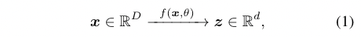

$z$的分布更加紧凑，有结构性。更加紧凑意味着存储起来更经济，更加有结构性意味着能更高效的来获取和使用：特别的，线性结构对于差值和外推是理想的。

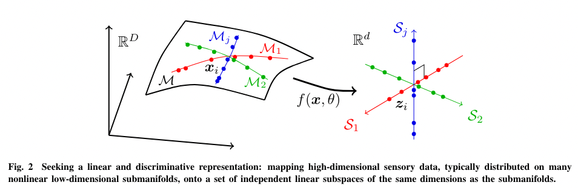

​		更具体和精确的说，好好举个视觉数据模型的例子，作为尝试，找到一个（非线性）转换$f$实现下面的目标：

* **压缩**：高维度映射到低维度
* **线性化**：把一个非线性的子流行（submanifold）上的目标分布的每一类，映射到一个线性的子空间
* **稀疏化**：映射不同类到子空间，要独立，或者基于最大不相关

​		换句话说，我们尝试分别转换 （可能依赖于，在一个高维空间的一族低维子流形）【真实世界数据】到【一族独立的低维线性子空间】。。。。。。。这句英文原文真绕，nnd

​		这样的模型叫 ***linear discriminative representation*（LDR）线性判别表示**（Yu et al.，2020；Chan et al.，2022），压缩过程在图2。说通常的深度学习实践中，映射每一类到一个“one-hot”向量，作为寻求一种很特别的LDR模型，每一个目标子空间是仅仅一维的，与其他正交。

​		压缩的观点作为大脑表示世界（传感器数据）的一个指导原则，在神经科学领域有一个很强的根源，要追溯到Barlow的高效编码假设（Barlow，1961）。科学研究已经表明，大脑的“视觉目标表示”展现出紧凑的结构，像稀疏编码（Olshausen and Field，1996）和子空间（Chang and Tsao，2017；Bao et al，2020）。这支持着观点that低维线性模型是更好的表示，在大脑（至少是在视觉数据）。

---

 		LDA算法概述：

​		线性判别式分析(Linear Discriminant Analysis, LDA)，也叫做Fisher线性判别(Fisher Linear Discriminant ,FLD)，是模式识别的经典算法，它是在1996年由Belhumeur引入模式识别和人工智能领域的。性鉴别分析的基本思想是将高维的模式样本投影到最佳鉴别矢量空间，以达到抽取分类信息和压缩特征空间维数的效果，投影后保证模式样本在新的子空间有最大的类间距离和最小的类内距离，即模式在该空间中有最佳的可分离性。因此，它是一种有效的特征抽取方法。使用这种方法能够使投影后模式样本的类间散布矩阵最大，并且同时类内散布矩阵最小。就是说，它能够保证投影后模式样本在新的空间中有最小的类内距离和最大的类间距离，即模式在该空间中有最佳的可分

---

​		**最大率失真**。

​		对于LDR模型家族，有关于“简约”的一个自然的内在度量，从直觉上讲，对于LDR，我们可以计算所有子空间上所有特征的总“体积”，以及每个类的特征所跨越的“体积”之和。然后，这两个体积之间的比率给出了一种自然的度量，表明LDR模型的良好程度：越大，越好。图3显示了一个示例，其特征分布在两个子空间S1和S2上。左右模型具有相同的内在复杂性。显然，左侧的配置是优选的，因为不同类的特征是独立的，并且它们的外部表示形式将是最稀疏的。因此，就这种基本的体积度量而言，最好的表示应该是“总体大于其各个部分的总和”。

​		根据信息理论，分布的体积可以通过其‘速率失真（rate distortion）’来衡量（Coper和Thomas，2006）。粗略地说，**速率失真是一个对数 of 多少 '$\epsilon $-球' 可以塞进到分布的空间中**。球数的对数直接转换为需要多少二进制位，以便根据精度 $\epsilon $ 对从分布中提取的随机样本进行编码。这也被称为'描述长度'(Rissanen, 1989; Ma et al., 2007).

​		后面公式推导不想翻了。。。

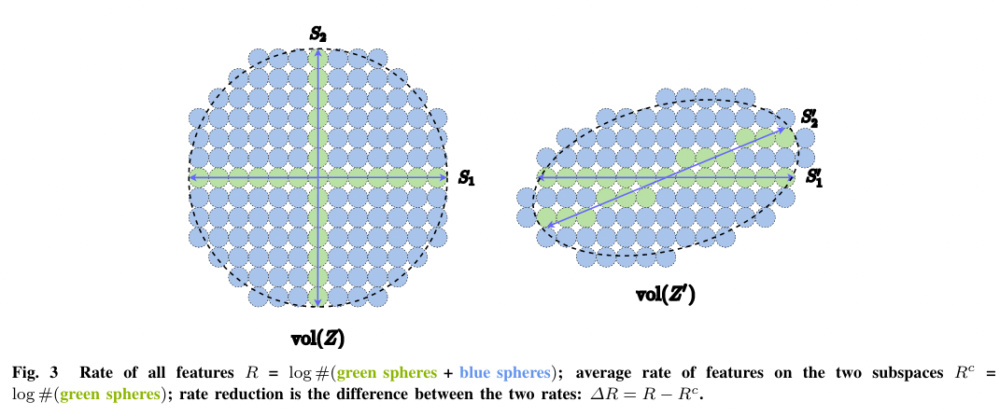

​		**WhiteBox深网络来自展开优化。**

​		**向前展开与向后传播。**

​		**转移和非线性。**

​		**神经网络的人工选择和演变。**

	### 2.2 怎么学：自洽原则

​		“Everything should be made as simple as possible, but not any simpler.”	– Albert Einstein

​		事情应该尽可能的简单，而不是更简单

​		仅简约原则并不能确保学习的模型将捕获有关外部世界的数据中所有重要信息。例如，将每个类映射到一维“one-hot”矢量，通过最大程度地减少交叉熵，可以看作是一种简约的形式。它可能会学到一个好的分类器，但是所学的特征会崩溃到一个被称为神经崩溃的单例（Papyan等，2020）。所学的功能将不再包含足够的信息来再生原始数据。即使我们考虑了更通用的LDR模型类别，仅降低速度目标也不能自动确定环境特征空间的正确维度。如果特征空间维度太低，则学习的模型将不足数据；如果太高，该模型可能会过度拟合。

​		更普遍的是，我们认为感知与特定任务的执行不同，而感知的目的是学习有关所感知的内容的所有可预测的东西。我们的意思是，智能系统应该能够从压缩表示中重新生成观察数据的分布，使其达到即使尽最大努力也无法在内部区分的程度。这个观点将我们的框架与现有框架区分开来，这些框架被定制为特定的任务类别，例如用于分类的信息瓶颈（识别）。为了管理学习完全忠实的表示的过程，我们介绍了第二个原则：

​		**自洽原则** 

​		一个自主智能系统通过最大程度地减少观察到的和再生之间的内部差异，为观察外部世界的观察而寻求一种最自洽的模型。

​		自称和简约的两个原则是高度互补的，应始终一起使用。仅自洽的原则并不能确保压缩或效率的任何增益。从数学上和计算上来说，适合具有过度参数化模型的任何训练数据，或通过在具有相同维度的域之间建立OneTo-One映射而没有学习固有结构的域之间的OneTo-One映射来确保一致性很容易，甚至很容易。只有通过压缩，才能强迫智能系统在高维感觉数据中发现固有的低维结构，并以最紧凑的方式在功能空间中转换并表示它们，以供将来使用。另外，只有通过压缩，我们才能轻松理解为什么通过使用数百个通道的特征提升来说，通常在DNN中进行的特征抬起，如果其纯粹的目的是在较高维度的特征空间中压缩，则不会导致过度拟合：提升有助于降低数据中的非线性，因此使压缩和线性化更加容易。后续层的作用是执行压缩（和线性化），通常层越多，压缩效果越好。

​		到目前为止，我们已经确定，我们需要一种机制来确定压缩表示是否包含所有感测到的信息。在本节的其余部分中，我们将首先介绍实现这一点的一般架构，即生成模型，该模型可以从其压缩表示中重新生成样本。然后出现了一个难题：如何敏感地测量感测样本和再生样本之间的差异？我们认为，对于一个自治系统，只有一种解决方案，即在内部特征空间中测量其差异。最后，我们认为压缩编码器和生成器必须通过零和博弈一起学习。通过这些推论，我们得出了一个普遍的学习框架，我们认为这是不可避免的。

​		**自动编码及其警告具有可计算性** 

​		为了确保学习的功能映射f和表示z在数据中正确捕获了低维结构，可以检查压缩特征z是否可以通过某些生成映射G重现原始数据x，该映射g，由η参数化。

​                             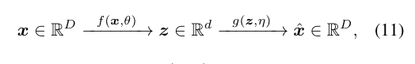  

在这个意义上，x_hat接近于x。这个过程通常被称为自动编码（Kramer，1991； Hinton和Zemel，1993）。在压缩到结构化表示（例如LDR）的特殊情况下，我们称之为自动编码转录24（Dai等，2022）。但是，这个目标说起来容易做起来难。主要的困难在于如何使该目标计算易处理，之后可以从物理上实现。更确切地说，**x和x_hat分布之间差异的原则性度量是什么，既有数学定义且有效地计算？**正如我们之前提到的，在处理具有退化低维支持的高维空间中的分布时，现实世界中的数据几乎总是如此(Ma et al., 2007; Vidal et al., 2016)，方便测量比如，KL散度，互信息，詹森-香农距离，Helmholtz自由能，Wasserstein距离可能是不明显的或顽固地计算的，即使对于高斯（在子空间上的支持）及其混合【25】。我们如何解决与比较高维空间中的退化分布相关的可计算性方面的这一基本但通常未被承认的困难？

---

【25】

​		许多现有方法根据这些数量制定其目标。结果，这些方法通常依赖于昂贵的蛮力抽样来近似这些数量或优化其近似下降或替代物，例如在变化自动编码（VAE）中（Kingma and Welling，2013年）。这些方法的基本局限性通常通过巧妙的启发式和过度的计算资源获得的良好经验结果掩盖。

---

​		**闭环数据转录，以进行自贯段** 

​		正如我们在上一节中所看到的，率失真∆R给出了退化分布之间定义良好的原则距离度量。但它仅适用于子空间或高斯混合，不适用于一般分布！然而，我们只能期望内部结构化表示z的分布是子空间或高斯的混合物，而不是原始数据x。

​		这就引出了一个关于学习“自洽”表示的相当深刻的问题：**为了验证外部世界的内部模型的正确性，自治代理真的需要测量数据空间中的任何差异吗？答案实际上是否定的。**关键是要认识到，为了比较x和ˆx，代理只需要通过相同的映射f来**比较其各自的内部特征**z=f（x）和ˆz=f（ˆx），**该映射f旨在使z紧凑和结构化**。

​		                          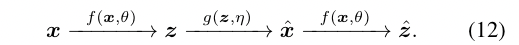

实际上，**测量Z空间中的分布差异是明确和有效的**：可以说，在自然智力的情况下，学会在内部测量差异是唯一一个独立的自动代理的大脑可以做到的。【26】

---

【26】

​		想象某人色盲，他/她对世界的内部表示不太可能需要最大程度地减少视觉输入x的RGB值的差异。

---

​		这有效地导致了“闭环”反馈系统，总体过程被说明为图6中的图。

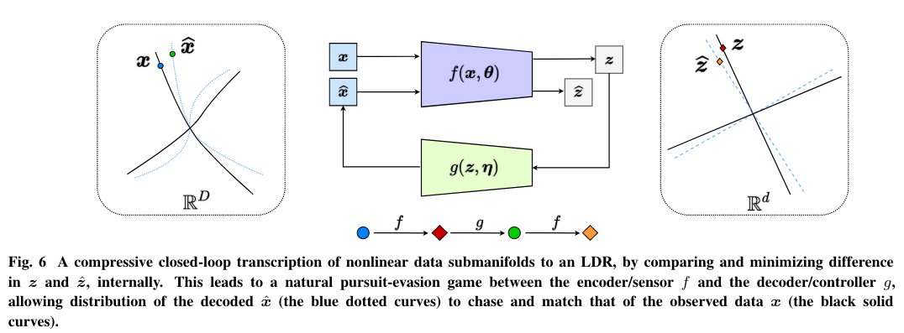

​		编码器f现在充当鉴别器，通过其内部特征z和ˆz之间的差异来检测x和ˆx之间的任何差异。可以通过其样本z和ˆz的速率降低（2）来测量Z和ˆZ分布之间的距离：

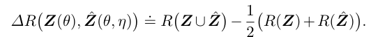

​		可以将  **单独**学习一个 DNN分类器f 或 学习一个 DNN生成器g 的流行做法，解释为，闭环系统的一个开放段（open-end segment）（图6）。**这种目前流行的做法非常类似于开环控制**，长期以来，**控制界一直认为开环控制存在问题且成本高昂**：训练这样一个环节需要对预期输出（例如，类别标签）进行监督；如果数据分布、系统参数或任务发生变化，则这种开环系统的部署本质上是不稳定、鲁棒或自适应的。例如，在有监督的设置中训练的深层分类网络通常会遭受灾难性的遗忘，如果通过新的数据进行了新任务（McCloskey and Cohen，1989）。相比之下，封闭环系统本质上更稳定和适应性（Wiener，1948）。事实上，Hinton等人（1995年）提出，分类和生成阶段需要分别作为完整学习过程的“唤醒”和“睡眠”阶段进行组合（没懂）。

**通过自我批评的博弈进行自我学习**		

​		然而,仅仅闭环是不够的。人们很容易认为,现在我们只需要优化生成器g以最小化z和ˆz之间的区别, 参考文献27说了下面一个速率衰减措施：公式不放了，就是改变‘eta’，让上面的delta R最小。

​		注意了啊，如^Z=Z，那delta R就是0 了。那就是，优化学习特征Z应该是编码—解码环的一个“fixed point” 。但是编码器f执行显著的降维和压缩，因此ˆZ=Z不一定意味着ˆX=X。要了解这一点，请考虑最简单的情况，即X已经在线性子空间（例如维度k）上，并且f和g分别是线性投影和提升（Pai等人，2022）。f将无法检测其（大）零空间中的任何差异：X和任何ˆX = X + null（f）在f下具有相同的图像。（null（f）就是f的零空间，也叫核空间，就是f（null（f））= 0）。

​		那么ˆZ=Z怎么能表示ˆX=X呢？换句话说，满足内部空间中的自一致性标准如何保证我们已经学会忠实地重新生成观察数据？只有当维度k足够低并且可以进一步调整f时，这才可能实现。假设X的维数k<d/2，其中d是特征空间的维数。线性提升g下的维数ˆX=g（f（X））是k维的子空间。X和ˆX的两个子空间的并集的维数最多为2k<d。因此，如果这两个子空间之间存在差异，并且f可以是任意投影，则我们得到f（X）不等于f（ˆX），即X 不等于ˆX意味着Z 不等于ˆZ。

​		因此，在g最小化误差∆R之后，如果X和ˆX之间存在剩余差异，例如通过最大化相同的度量，f需要在其最大容量下主动调整和检测∆R、 该过程可以在编码器f和解码器g之间重复，并导致自然的“追逐”和“逃避游戏”，如图6所示。

​		在1961年版的《控制论,维纳(1961)已添加补充章讨论通过博弈学习。他描述的游戏主要是关于一个智能代理对抗对手或世界（我们将在下一节讨论）。在这里，我们提倡需要一种内部类似博弈的机制，使任何智能代理都能够通过自我批评进行自学习！一直以来，博弈是一种普遍有效的学习方式：针对对手的批评，反复应用当前模型或策略，从而根据通过闭环收到的反馈不断改进模型或策略！

​		在这样的框架内，编码器f承担着双重作用：除了通过最大限度地降低速率来学习数据x的表示z之外∆R（Z）（如第2.1节所述），它还应充当反馈“传感器”，主动检测数据x和生成的ˆx之间的差异。解码器g还承担双重作用：它是一个“控制器”，用于纠正f检测到的x和ˆx之间的任何差异，以及一个试图最小化实现这一目标所需的总体编码速率的解码器（以给定精度为准）。

​		因此，最优的“简约”和“自洽”表示元组（z，f，g）可以解释为f（θ）和g（η）之间零和博弈的平衡点，在基于速率降低的组合效用上：

​									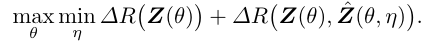

最近的分析严格表明，**在输入数据X位于多个线性子空间的情况下，Z的理想最优表示确实是序列maximin博弈在类似于上述速率降低目标（Pai等人，2022）上的Stackelberg均衡（Fiez等人，2019；Jin等人，2019）。当X在多个非线性子流形上时，这仍然是一个开放问题**。然而，令人信服的经验证据表明，求解该博弈确实为真实世界的视觉数据集提供了非常好的自动编码（Dai等人，2022），并自动确定每个类具有适当维数的子空间。**在训练GAN等传统生成模型时，它似乎没有出现模式崩溃等问题（Srivastava等人，2017年）。如此学习的表征同时具有辨别性和生成性。**

**自洽的增量和无监督学习**

​		到目前为止，我们已经主要讨论了监督学习的两个原则。事实上，我们的框架的主要优点之一是，通过自我监督和自我批评，它对自我学习最自然、最有效。此外，由于速率降低寻求学习结构的显式（子空间类型）表示，**这使得在学习新任务/数据时，过去的知识很容易保留，作为先验（记忆）保持自洽**。

​		更清楚的是，让我们看看如何将上述闭环转录框架自然扩展到**增量学习的情况下——即，学习一次识别一类对象，而不是同时学习多个类**。在学习新类的表示Z_new时，只需将cost添加到目标（14）中，并确保之前为旧类学习的表示Z_old通过闭环转录保持自一致（固定点fixed point）：Z_old≈ ˆZ_old=f（g（Z_old））。换句话说，上述maximin博弈（14）成为约束博弈：

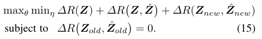

这种约束博弈使学习成为一个增量和动态过程，因此学习的转录可以不断适应新的输入数据。这一过程如图7所示。

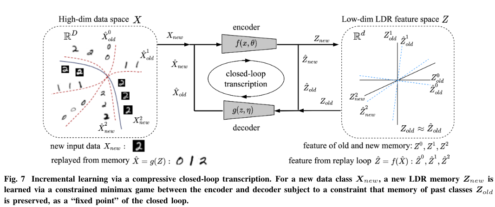

​		最近的实证研究（Tong等人，2022）表明，这可以证明是第一个具有固定容量的自包含神经系统，可以增量学习良好的LDR表示，而不会遭受灾难性遗忘（McCloskey和Cohen，1989）。在这样一个闭环系统中，遗忘（如果有的话）是相当优雅的。此外，当旧类的图像再次提供给系统进行审查时，学习的表示可以进一步巩固——这一特征与人类记忆非常相似。在某种意义上，这种受限闭环公式从根本上确保了视觉记忆形成可以是贝叶斯和自适应的，即假设大脑需要的特征（Friston，2009）。

​		注意，该框架基本上是在完全无监督的环境中工作的。因此，即使出于教学目的，我们提出了假设类信息可用的原则，该框架也可以自然地扩展到完全无监督的环境，在这种环境中，任何数据样本都没有类信息。在这种情况下，我们只需将每个新样本及其扩充视为（15）中的一个新类。这可以被视为一种“自我监督”结合“自我批评”博弈机制，可以轻松学习压缩闭环转录。如图8所示，这样学习的自动编码不仅显示出良好的样本一致性，而且学习的特征还显示出清晰而有意义的局部低维（瘦）结构。更令人惊讶的是，即使在训练期间没有提供任何类信息的情况下，子空间或特征相关中的块对角结构也开始出现在为类学习的特征中（图9）！因此，如此学习的特征的结构类似于在灵长类动物大脑中观察到的类别选择区域的结构（Kanwisher等人，1997；Kanwisher，2010；Kriegeskorte等人，2008；Bao等人，2020）。

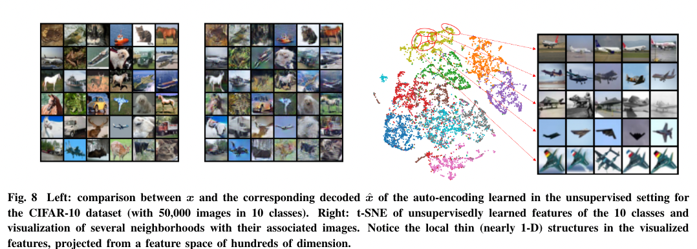

​                                      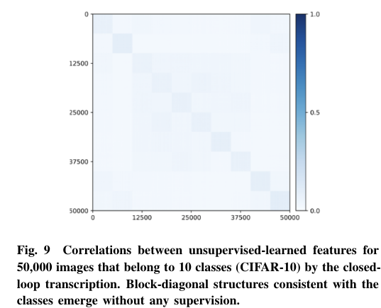

## 3 通用学习引擎

​		只要是我不能创造的，就是我不能理解的。意思就是自己能理解的，就能创造出来。——里查德 费曼

​		在上一节中，我们以视觉图像数据建模为例，从简约性和自洽性的第一原理推导了压缩闭环转录框架。在剩下的两个部分中，我们对该框架的普遍性提供了更多的推测性想法，将其扩展到三维视觉和强化学习（本节的其余部分）30，并预测其对神经科学、数学和高级智能的影响（第4节）。

看不下去了，再见，再见