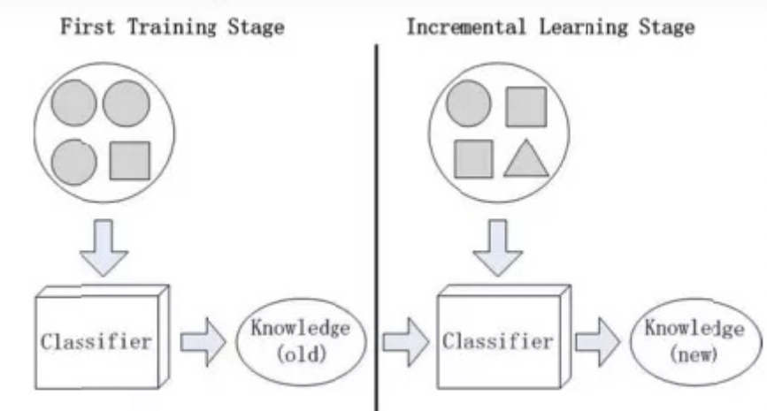
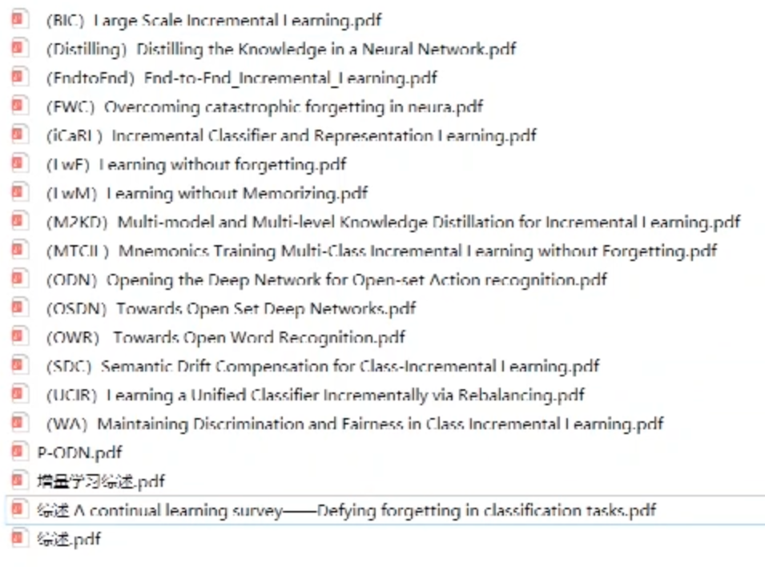
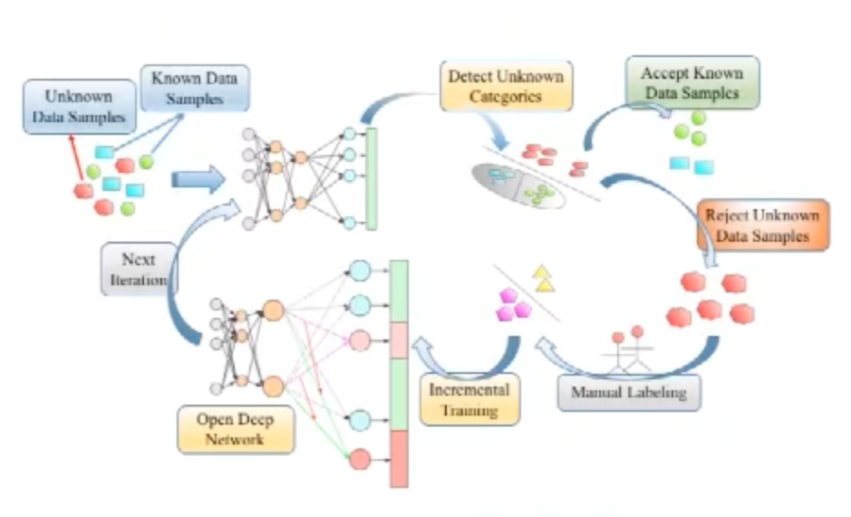
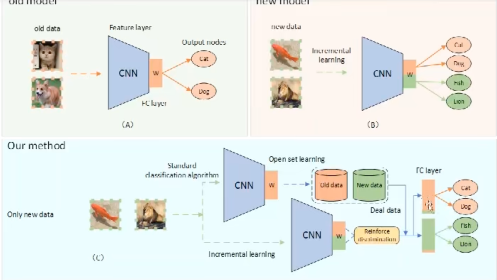

本综述从数据的变化这个角度，将增量学习分为三类。

- 样本增量学习
- 类别增量学习
- 特征增量学习

基于统计学习方法的数据自动分类方法的一个假设是：**用于分类模型的训练数据和测试数据来自于同一个总体分布，且两者的特征空间是一样的**（测试数据的特征空间默认是由训练阶段构造的）。然而，随着时间的推移，数据分布和数据特征会发生变化。一段时间后，基于历史数据训练的分类模型可能不适用于一些新的数据。因此，有必要面向自动化分类系统的实际应用，实现增量学习和动态更新，以保证不断变化的数据能够被正确分类。

## 增量学习的背景

传统实际应用场景下，机器学习过程是渐进的：

1）标注数据，训练一个模型，用模型预测或分类新数据

2）数据变化，新数据和旧数据合并，重新训练

计算机技术和应用的快速发展，各行业积累了大量数据，呈几何倍数增长。

数据分析和数据处理的新问题：

a.标注数据代价高

b.数据集过大，训练时间过长，导致时间消耗和用户体验差

c.传统方式重新训练数据集，程序处在封闭状态，不适应在线应用

d.一般的机器学习分类方法，不能识别和更新新类，不能满足实际需求。

**增量学习有以下四个特点**：

1. 分类器能够从新数据中学习新知识。如图1所示，分类器能够学到圆圈和方块的比例的变化。

2. 学习和训练的数据只是新数据。不需要重复训练之前的训练数据。

3. 获取新知识的同时，分类器能够整合旧知识。

4. 分类器能够适应，识别和更新新的类别。如图1所示，增量学习阶段，分类器学习到了三角形。增量学习能够识别三角形，并且将三角形扩展到之前的类别中。【起步阶段，研究较少】

在当前的增量学习研究中，在特征1(学习新知识)、特征2(只训练新数据)和特征3(融合新旧知识)的研究方向上取得了一定的成果。然而，特征4(识别新类)的研究还处于起步阶段，相关研究较少。同时，特征3(融合新老知识)指的是融合的概念，简单的融合就是加上。相比之下，还有另一种“减少”的概念，意思是**减少旧的知识。这涉及到简化学习[3]的概念**，它还可以调整分类的准确性。本文的研究重点是渐进式学习的研究，因此对缩减式学习的研究并不会占用太多的空间。

增量学习可以分为3类：**样本增量学习（SIL），类别增量学习（CIL），特征增量学习（FIL）**。 

1. SIL

问题：由于新数据的各种原因，样本的特征值可能会改变，每个类别的比例也会改变。这些都会影响分类的准确率。

任务：因此，需要确保在现有知识的情况下，通过新样本的增量学习来提取新知识，融合新旧知识以提高分类的准确性。

2. CIL

任务：识别新类，并将其加入现有类别的集合中，提升分类的准确性和智能。

3. FIL

一些新的属性特征能够将分类提升到一个很大的程度，并提升分类准确率。

任务：在现有特征空间的基础上，加入新的属性特征，构建新的特征空间，提升分类准确率。

> 以上引用自 https://zhuanlan.zhihu.com/p/404623345

## 增量学习创新点如何找

> https://www.bilibili.com/video/BV1S64y197JZ?spm_id_from=333.337.search-card.all.click&vd_source=212d884b9d136f4bb815ae0aa4abb7b0

1. 增量学习的研究现状
2. 论文创新点如何找到的
3. 提供一个可行的创新点

论文的时候：

一定要对比目前最好的算法

2022年最好的一篇结果

在我们写论文的时候

随便找一篇2022年的论文A（CVPR顶刊），哪怕发现另一篇2022年的论文B>A，你需要做的仅仅是对比A即可（只要性能比A好）

增量学习

让计算机像人类 学新的知识 不遗忘旧的知识

比如分类问题

已知类别的图片——深度学习模型—— 已知类别的图片正确的分类

未知类别的图片——增量学习模型——已知类别的和未知类别的分类

**增量学习分为三类：**

比如旧的类：猫、狗。。。新的类：鱼

1、使用部分旧数据集

旧的类中，取出一部分猫、狗，与新的类鱼放到一起，进行增量学习

2、GAN的方法

使用深度学习模型，用GAN的形式创造出猫和狗的数据集，和鱼再一块进行增量学习

3、不实用任何旧类别数据集

目前有特别多的研究方法，每篇的都不太相同

---

up主文章原文：

​	这项工作可以大致分为三类：这取决于它们是否需要真实的旧类别数据或者合成的旧类别数据，还是不需要任何来自旧类别的数据。在本节中，我们将简要讨论这些方法。

​	**使用真实的旧数据示例：**这类方法也是目前三种方法中效果最好的方法，如ICARL[9]、UCIR[10]、BIC[11]。[9]提出了一种样例管理的方法，其在增量训练前从旧样例集的每类中筛选少量样本和新样本组合成新的训练数据集。然而对于MCIL问题，新类别的和旧类别数据不平衡问题严重，仍然会导致灾难性遗忘。[15]引入了平衡微调和临时蒸馏，缓解新旧类别阶级间的不平衡。[10]采用Cosine Normalization Based Classifier试图消除量级的影响，并采用less forget constrain从参数的角度降低灾难性遗忘。[11]增加了一个偏置校正层来校正模型的输出，以解决类别不平衡问题。[12]采用加权对齐(Weight Aligning)的方式处理了类别平衡问题。[16]采用助记符的方式优化旧样本数据集，来降低灾难性遗忘。

​	**使用生成的旧数据示例：**这种方法主要采用GAN[17]网络构建生成旧数据集的方式。[18]在条件GAN框架中融入了记忆重现的生成器。[19]提出了一个连续学习条件图像生成模型的通用框架。[20]提出了一种现实地记住具有遗忘的生成过程流的GAN记忆。[21]提出了一个高生成质量且参数数量更少的参数高效框架。然而这种方法需要额外训练一个生成模型，并且严重依赖于生成模型的质量。

​	**不使用任何旧数据集：**这一种方法无需任何旧数据集，其中知识蒸馏[22]是广泛应用的方法。[6]改进交叉熵损失函数让模型具有保持旧模型的能力，以应用于MCIL问题。[23]采用辅助蒸馏的方式，以进一步保存增量过程中模型的中间特征知识。然而由于旧数据集，仅使用知识蒸馏的方法几乎无法克服数据类别不平衡问题。此外，参数控制法也被应用于没有任何旧类别的增量学习，[24]对旧模型最重要的权重进行了约束，期望重要的参数变化小。然而参数约束这种方法很难准确测量，因此在MCIL问题中往往效果不佳。<u>[1]和[2]均采用了修改模型结构的方法克服增量学习中的灾难性遗忘问题，该方法可以在很大程度上缓解模型对旧知识的遗忘，但模型需面临不断被扩增的风险。</u>

​	我们的OSIL方法属于第三类，我们在训练过程中不使用任何旧类别数据集。但是我们处理新旧数据集不平衡问题的方法与其他人的方法完全不同。我们首先在增量学习模型分类层中定位两个强偏置，使得模型分别在新类别图像和旧类别图像都具有更好的性能。

---

增量学习（创新点很难找）

1、加入旧类别数据集的增量学习

2016开始研究，17、18、19、20年比例占大概80%、

类别不平衡问题（部分旧类别（小），新增类别数据集可能很大，模型肯定偏向数据集大的，过拟合问题，解决方案：BIC算法，WA算法，UCIR算法，MTCIL（极限））

MTCIL，想法就是如何能动态的生成合适的旧类别数据集。一般随机选取旧的，或者选重要的，但是这个算法是动态的生成合适的，已经效果很好了（不太建议）。

2、GAN

up主说自己研究的比较少，自己电脑性能也不行

3、不采用任何旧数据集

现阶段研究方向：

1、加入注意力机制（LwM,2018）(他的注意力机制是加了一个模块)

**up主自己创新点**就是（SeNet，一个专门针对注意力机制的模型）

他们论文有一个共性，基本都用ResNet，up主提出的（ResNet  SeNet）

并行卷积网络（网络模型的结构）（小点1）

增量学习想法

WA论文来的，就是改FC的权重防止类别不平衡问题

结合WA的思想，通常在训练中操作，有没有可能在测试中合理的操作，测试数据集（新类别的和旧类别混合在一起，无序），这两种数据集分开，针对新类别的模型，针对旧类别的模型，提升指标的创新点

开集识别算法（可以帮助我们实现）:OSVM （传统）,Openset（深度，2016），现在的开集识别算法肯定会更好

---

up主原文：

​	在本文中，我们的主要贡献是：

​	（1）我们通过实验证明，在不使用任何旧数据的情况下，加入注意力机制的网络结构在增量学习过程中能够更好降低对于旧类别的遗忘。但是并不是所有修改模型的方法都能有效克服灾难性遗忘，例如多通道并行卷积只有助于提升模型分类的准确率。所以我们建议，在不使用任何旧数据的情况下，将标准增量模型统一成加入注意力机制的网络模型。

​	（2）我们提出了一种增强歧视的方法，它能够在不占用内存的情况下辅助增量模型更好的适用于新旧类别。同时我们创新性的将开集学习与增量学习融合，并提出了一种增强歧视的开集增量学习算法。提出的方法（OSIL）可以在不使用任何旧数据的情况下，充分利用开集识别的思想，更好的降低灾难性遗忘的影响。

​	与探索统一问题的当代方法不同，OSIL首次将增量学习与开集识别真正的融合，在没有任何旧数据的情况下，更好的防止模型更偏向于新增数据，进而更好的降低了灾难性遗忘问题。我们进行了广泛的实验，结果表明，我们的方法比以前的方法具有更好的性能。

ODN（Opening the deep network for open-set action recognition, 2019）开集识别

---