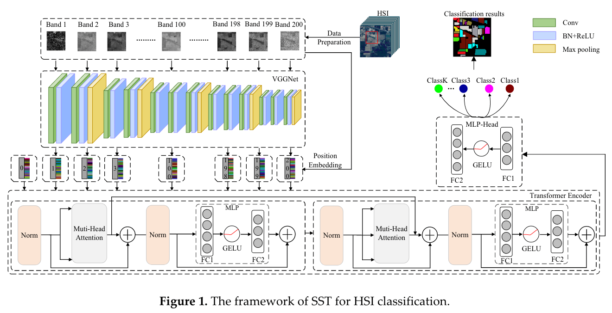
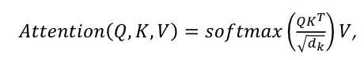
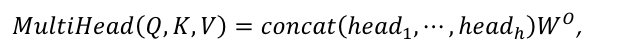
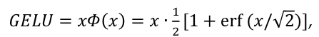
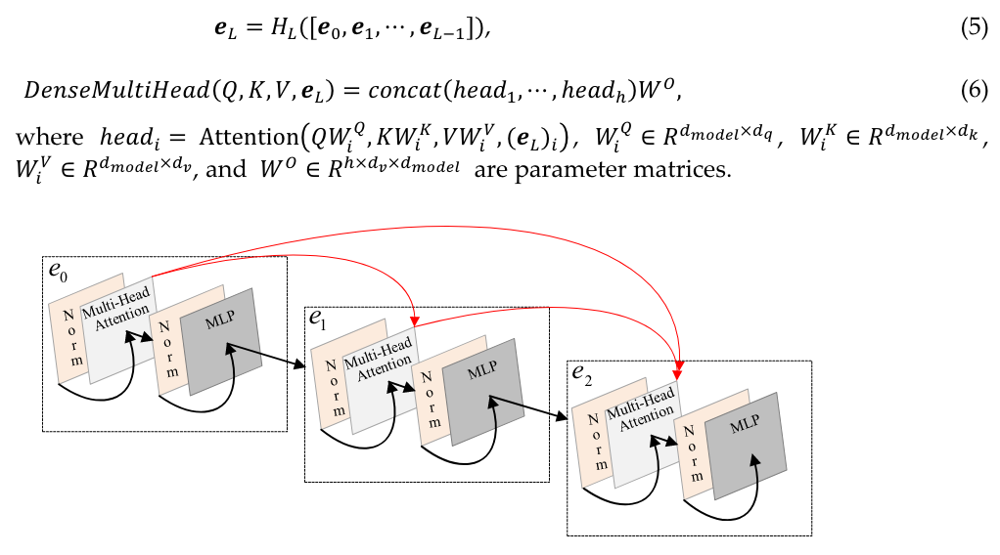
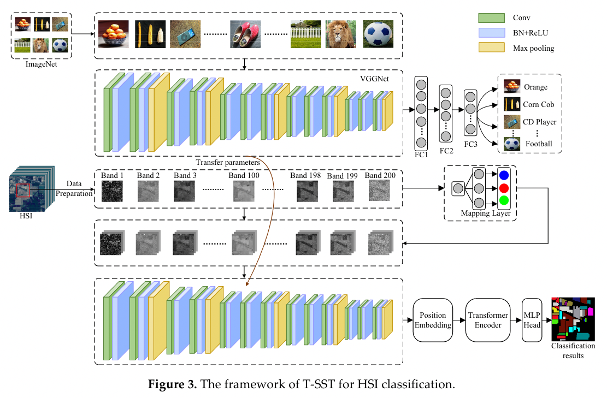
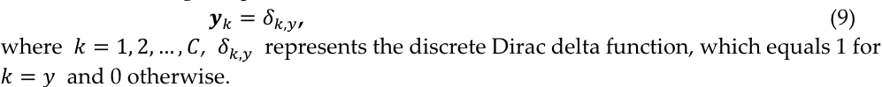
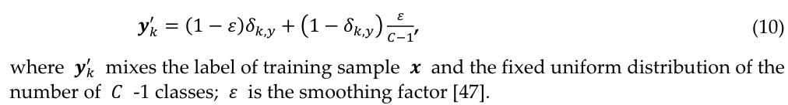

# 高光谱图像分类：空间—光谱 transformer ！

2020年，哈工大，何欣，remote sensing

## 摘要

最近，已经提出了许多基于许多深度卷积神经网络（CNN）的方法用于高光谱图像（HSI）分类。尽管所提出的基于CNN的方法具有空间特征提取的优势，但它们**很难使用顺序数据，并且CNN不擅长建模远距离依赖性**。

但是，HSI的光谱是一种顺序数据，HSI通常包含数百个频段。因此，CNN很难很好地处理HSI处理。另一方面，基于注意机制的**transformer模型已证明其在处理顺序数据方面具有优势**。为了解决长期捕获HSI中顺序光谱关系的问题，在这项研究中，研究了transformer进行HSI分类。

具体而言，在这项研究中，提出了一个新的分类框架，标题为“空间 - 光谱transformer（SST）”进行HSI分类。在提出的SST中，用精心设计的CNN提取空间特征，并提出了修改后的transformer（具有稠密连接的transformer，DenseTransformer）来捕获顺序光谱关系，并使用MLP来完成最终的分类任务。

* "动态**特征增强（**Feature Augmentation）"，旨在减轻过拟合问题，让模型更好的泛化，被提出并添加到SST上**（SST-FA）**

* 此外，为了解决HSI分类中训练样本有限的问题，将**迁移学习**与SST结合在一起，提出了“ Transferring-SST**（T-SST）**”
* 缓解过拟合问题并提高分类精度，引入**标签平滑**，提出基于T-SST的**（T-SST-L）**

提出的4个框架，用在3个广泛使用的HSI数据集上，结果表明，与SOTA相比，提出的模型提供了竞争性结果，这表明transformer的概念为HSI分类打开了新的窗口。

**关键词**：classification；CNN；HSI；Transformer

## 1、介绍

==第一段讲了HSI现在越来越有用了，HSI的应用==，**为了更好的使用它，有很多数据处理技术**，比如解混，检测，和分类，这就**引出了文章要讲的分类**。

==第二段讲**分类是干啥**==，为了分出每个像素的内容【9】

==第三段**传统分类方法综述**==，已经有很多有监督的分类方法了，**早期分类只使用光谱信息**，【12】介绍了典型的基于SVM的光谱分类器。SVM对高维度敏感度低【13】，因此很多基于SVM的分类起被提出解决分类问题【14】。讲完这个，就说**HSI其实还有很多空间信息的，是reasonable来开发“spectral-spatial”分类器的**，大量的morphological形态学的操作，被用来提取空间特征，比如形态剖面MPs【15】，扩展MPs（EMPs），扩展多属性剖面EMAP【17】...然鹅，**上述这些都不是深度模型**【11】

==第四段就讲**深度学习方法**了==，【19】引入了堆叠的自动编码器作为HSI特征提取和分类的深层模型。在这之后，深度置信网络[20]，CNN [21,22]，RNN[23,24]，GAN[25,26]和胶囊网络[27,28] ，**获得了良好的分类性能**。

==第五段==讲，由于局部连接，共享权重，使CNN能有效提取局部相关性，CNN在图像处理，HSI分类相当有用（**反正就废话，在这说两句CNN**）。具体应用分三种：光谱CNN，空间CNN，空谱CNN。         

* 光谱CNN，Hu等人提出5层1d CNN提取光谱特征【29】，进一步，【30】提出了一个有趣的工作，用CNN提取“像素对特征”pixel-pari features，效果挺好。

* 空间CNN，2-D CNN提取空间特征，【31】像素为中心的领域的裁剪空间patch，被用来训练2dcnn
* 空谱CNN，因为输入是一个cube立方体，用3d卷积来分类【32】，【33】提出3D深度CNN来联合提取空谱特征，通过计算多尺度特征。【34】3d卷积，BN层，分别用来提取空谱信息，正则化模型。

最后说，由于分类性能好，**近年来CNN已经是HSI分类的事实de-facto标准**了

==第六段讲，现有CNN模型在HSI分类已经是SOTA了，然鹅还有不足==。主要说的1dcnn，一些信息被忽略了，针对每个像素序列用CNN那种，说只能提取局部信息，长序列的相关性不行。（你这前面还说了有空间CNN，空谱CNN，这块说不好，就只说1dcnn了？？？？？）

==第七段就提到transformer==了，是基于自注意力机制的，使用注意力来获得序列的全局相关性。这种深度学习方法都有梯度消失问题，于是用dense连接来加强特征传播，叫**DenseTransformer**，就是本研究提出的。

进一步，提出两个分类框架：

* CNN，DenseTransformer，MLP
* 还是这个，只不过用有限训练样本训练，迁移学习

==第八段讲自己一点微小的贡献==：

* 1、改了下人家Transformer，起个名字叫DenseTransformer，解决梯度消失问题（但是人家自身不就是用到ResNet了嘛）
* 2、 一个新的分类框架，SST，空谱transformer
* 3、动态特征增强，SST-FA，缓解过拟合问题，泛化模型
* 4、迁移学习，T- SST
* 5、label smoothing与T- SST结合，叫T- SSL- L

==第九段讲下面文章结构==：第二节讲SST，第三节讲T-SST，第四节实验结果讨论，第五节结论。

## 2、空谱Transformer

SST分为三部分：CNN提取空间特征，Transformer提取空谱信息，MLP分类

首先，对每个波段，一个2D patch（包含了每个被分类像素的临近像素）作为输入。

一个训练样本，n个patches（也就是波段数）

一个设计好的CNN来提取每个2D patch的特征，提取完送给transformer

然后改进的transformer来获得序列化的空间特征的关系

最后，获得的空谱特征被使用来获得分类结果。

### 2.1 基于CNN的空间特征提取

每个波段用2d CNN处理。

讲了VGG，说他改VGG了，具体在实验部分讲。

### 2.2  空谱Transformer：SST

自注意力机制可以获得每两个波段的关系。CNN提取的特征进入transformer来学习长范围的依赖性，主要包含三个元素。

#### 第一个元素：位置编码

获得不同波段的位置信息。它修改最后一部分的输出特征，修改依赖于它的位置，不改变这些全部特征。一个可学习的位置编码（数字零）它的状态作为波段的整个代表，可学习的位置编码和第三部分结合来完成分类任务。

####  第二个元素：Transformer编码

核心部分；包含d个编码块，每个块又由一个多头注意力和一个多层感知机组成，加上LN层，残差连接。

每个编码块中，每个多头注意力和一个MLP前都加上归一化层，每个多头注意力和MLP后面都有残差连接（就是下图中待的黑箭头）。

这就是经典的attention的QKV的计算，还有多头，就不赘述了

多头注意力提取的特征512维特征，给到MLP层，MLP由全连接组成，用上了GELU激活函数，Gaussian error linear unit

relu的变体，$\phi(x)$是高斯累积分布函数

又讲了归一化是干啥的，咋做的

DenseTransformer，就是把每个Block稠密连接下（下图红色箭头），多头那里其实就是concat，然后乘个W0线性组合下

#### 第三元素：transformer出来接MLP

两个全连接层，GELU，softmax

### 2.3 动态特征增强

SST容易过拟合，需要合适的正则化来让他能更好的泛化，动态特征增强就是一个简单的正则化技术，就是在==训练时随机mask out特征==。这就形成个新的分类器，叫SST- FA了。说这样就能提升鲁棒性和分类性能。

VGG提取的空间维度太高了，512，用transformer模型时候容易过拟合。在特征中随机选一个坐标，周围放上mask，这决定了多少特征被设为0。训练过程中，这个坐标随着epcoh动态的改变，这确保了transformer模型接收不同的特征。

## 3、参差的迁移SST

就说样本少是个问题，迁移学习来解决。迁移学习，从源域提取知识，迁移到目标域【44】，比如CNN，源域学到的权重可以被用来初始化目标域。因此，训练样本有限时候，迁移学习可以提升分类性能。

#### 3.1 两个数据集的参差匹配

大部分数据集都是RGB三通道，但是HSI上百个，用一个maping层来解决这个问题。

预训练的模型在大规模的ImageNet数据集，有三通道，但是T- SST输入只有一个通道。

就是用个可学习的核，把一个波段的一张图，变成三张

#### 3.2 T-SST

没啥

#### 3.3 提出T-SST for 高光谱图像分类

标签one hot是“hard label”，用label smoothing

就是把yk变成yk‘

标签平滑可以减轻过拟合问题，并以简单形式提高模型的概括能力

### 4、实验结果

#### 4.1 高光谱数据集

#### 4.2 训练细节

#### 4.3 参数分析

#### 4.4 SST和SST- FA的分类结果

#### 4.5 T-SST和T-SST-L的分类结果

#### 4.6 Transformer编码的分析

#### 4.7 分类图

#### 4.8 时间消耗

